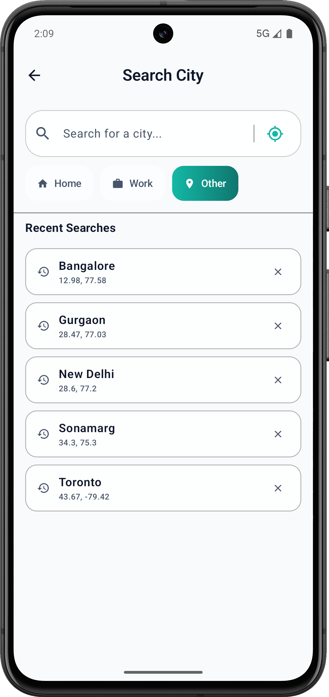
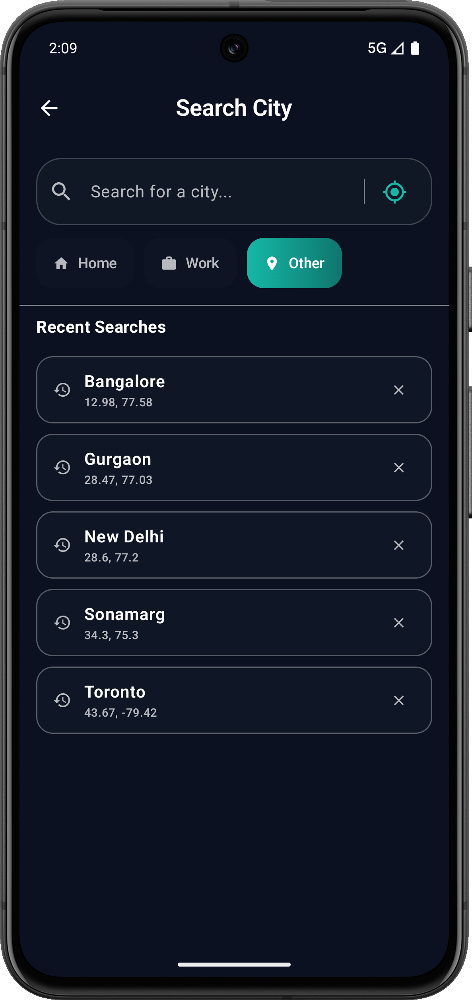
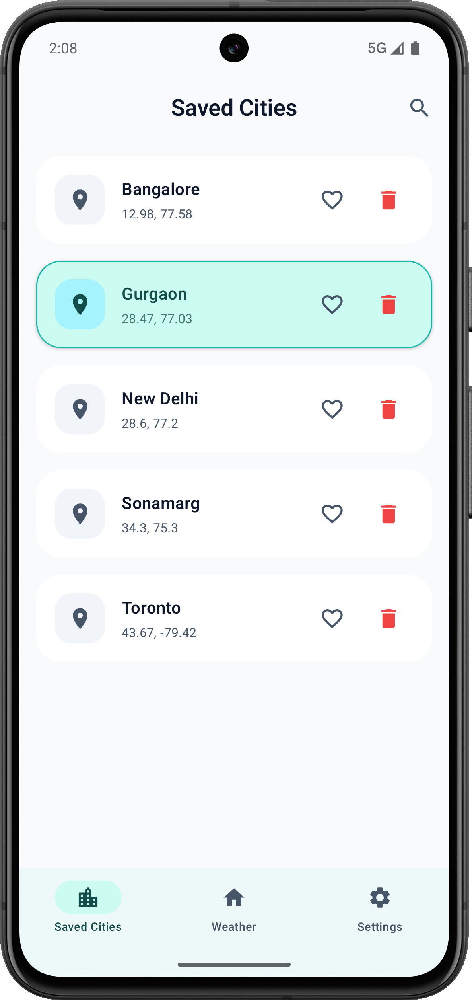
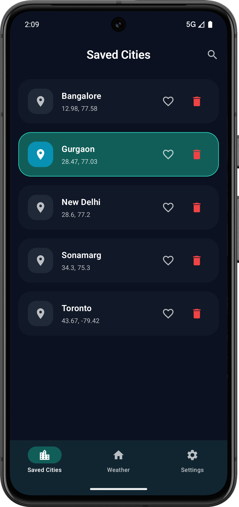
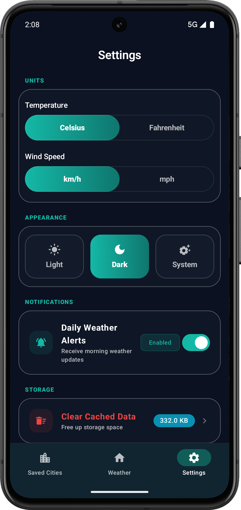

# WeatherApp - Modern Android Weather Experience

[](https://kotlinlang.org)
[](https://developer.android.com)
[](https://developer.android.com/jetpack/compose)
[](https://gradle.org)
[](https://kotlinlang.org/docs/ksp-overview.html)
[](https://opensource.org/licenses/MIT)

WeatherApp is a sophisticated Android application developed using Jetpack Compose. It delivers high-fidelity, real-time meteorological data and comprehensive city management features. The project is engineered following Clean Architecture principles and the MVVM design pattern to ensure scalability, maintainability, and testability.

---

## Features

- **Real-Time Weather Data**: Seamlessly fetches live updates for global locations via integration with the WeatherAPI service.
- **Advanced Metrics**: Provides in-depth analysis of temperature, atmospheric pressure, wind velocity, humidity levels, UV index, and Air Quality Index (AQI).
- **Location Management**: Robust system for saving and organizing multiple favorite locations with an intelligent search and suggestion mechanism.
- **Material 3 Interface**: A contemporary user interface leveraging Material You concepts, featuring dynamic color support and weather-adaptive UI states.
- **Offline Reliability**: Implements an offline-first strategy using Room database for caching weather data and DataStore for persistent user preferences.
- **Glance App Widget**: A modern home screen widget built with Jetpack Glance, offering immediate weather insights without opening the application.

---

## Screenshots

### Home and Search Interface
| Light Mode | Dark Mode |
|:---:|:---:|
|  |  |
|  |  |

### Saved Locations and Settings
| Light Mode | Dark Mode |
|:---:|:---:|
|  |  |
|  |  |

---

## Technical Architecture

The application is architected using the Clean Architecture pattern, divided into three distinct layers to maintain a strict separation of concerns.

### 1. Domain Layer
The central layer containing pure business logic. It is independent of any other layers or frameworks.
- **Entities**: Business models such as `Weather`, `City`, and `AirQuality`.
- **Use Cases**: Encapsulates specific business logic like `GetWeatherUseCase`, `SaveCityUseCase`, and `SearchCityUseCase`.
- **Repository Interfaces**: Defines the contracts for data operations that the Data layer must implement.

### 2. Data Layer
Responsible for data orchestration from various sources.
- **Remote Data Source**: Handles network operations using Retrofit and OkHttp.
- **Local Data Source**: Manages persistent storage using Room for the weather cache and DataStore for user settings.
- **Repositories Implementation**: Implements the domain repository interfaces and manages the data flow logic (e.g., caching strategies).
- **Mappers**: Converts data transfer objects (DTOs) from the API or database into domain entities.

### 3. Presentation Layer
Managed by Jetpack Compose for a fully reactive UI.
- **ViewModels**: Leverages Hilt for dependency injection and state management using `StateFlow`.
- **Screens**: Modular Composable functions representing different application states.
- **Components**: Reusable UI elements such as `WeatherCard`, `CityItem`, and `ErrorView`.
- **Theme**: Custom implementation of Material 3 with specific support for weather-based dynamic gradients.

---

## Technology Stack

### Core Development
- **Kotlin**: Utilized for its safety features and concise syntax.
- **Jetpack Compose**: The modern toolkit for building native Android UI.
- **Kotlin Coroutines and Flow**: Handles asynchronous programming and reactive data streams.

### Dependency Injection and Processing
- **Hilt**: Built on top of Dagger to provide a standard way to incorporate DI into the application.
- **KSP (Kotlin Symbol Processing)**: Used for high-performance annotation processing for Room and Hilt.

### Data Persistence and Networking
- **Room Database**: Provides an abstraction layer over SQLite for robust local data handling.
- **DataStore Preferences**: A modern replacement for SharedPreferences, utilizing Coroutines and Flow.
- **Retrofit**: A type-safe HTTP client for Android and Java.
- **Kotlinx Serialization**: A Kotlin-first approach to JSON parsing and serialization.

### Additional Utilities
- **Coil**: An image loading library for Android backed by Kotlin Coroutines.
- **Jetpack Glance**: Used for building App Widgets that are consistent with the Compose UI model.
- **Accompanist**: A collection of libraries that supplement Jetpack Compose with extra features.

---

## Getting Started

### API Configuration
This application integrates with the [WeatherAPI.com](https://www.weatherapi.com/) service.
1. Register for an account and obtain a free API key.
2. In your project's `local.properties` file, add the following entry:
   ```properties
   WEATHER_API_KEY=your_actual_api_key_here
   ```

### Installation Procedures
1. Clone the repository to your local environment:
   ```bash
   git clone https://github.com/yourusername/WeatherApp.git
   ```
2. Launch Android Studio (version Koala or more recent is recommended).
3. Allow the project to sync with Gradle.
4. Execute the application on an emulator or a physical device.

---

## Project Directory Structure
```text
com.weatherapp
├── data         # Network and Database implementations, DTOs, and Repositories.
├── domain       # Business logic entities, Use Cases, and Repository interfaces.
├── presentation # Composable UI, ViewModels, Theme, and Navigation.
├── di           # Hilt modules for Dependency Injection.
└── utils        # Shared utility classes, formatters, and helper extensions.
```

---

## License
This project is licensed under the terms of the MIT License. Detailed information is available in the [LICENSE](LICENSE) file.

---
**Developed by Vasu**
