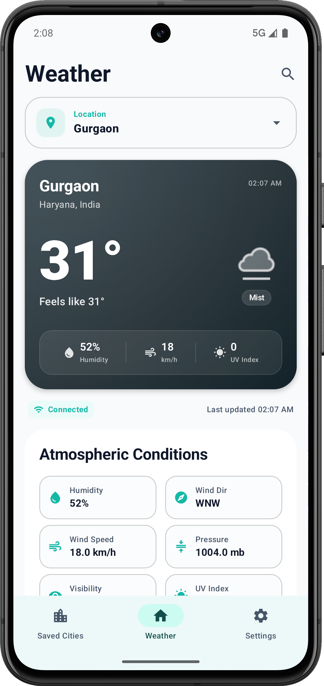
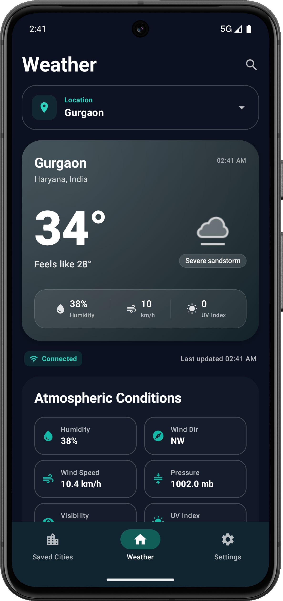
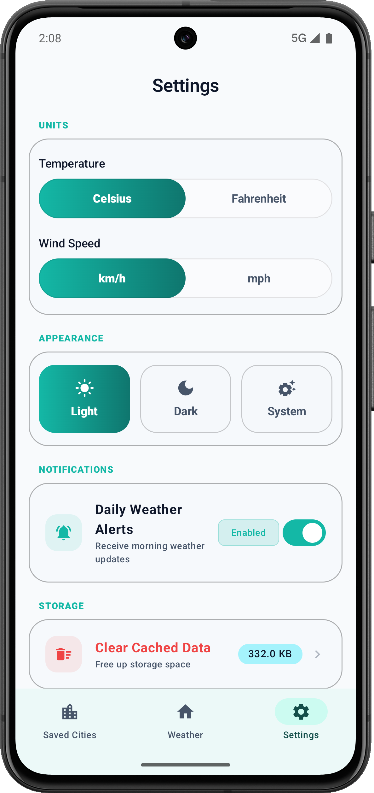
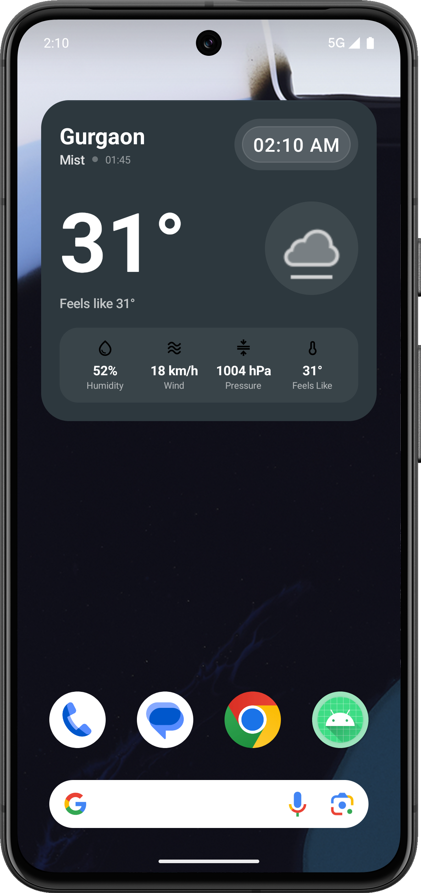
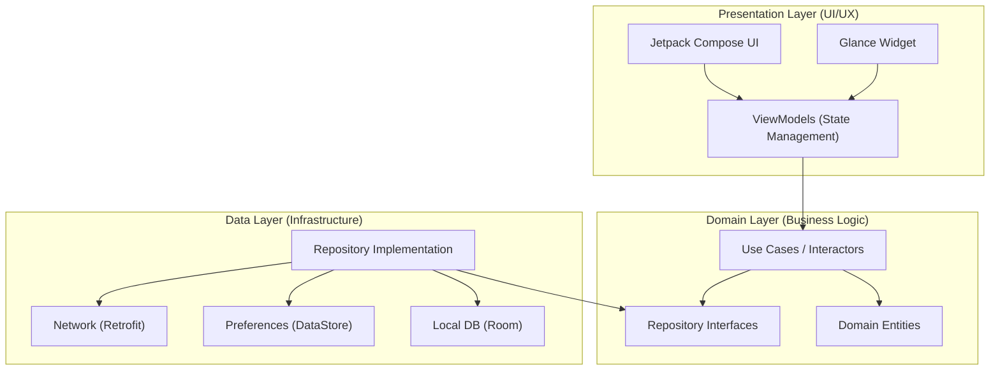

# WeatherApp

[](https://kotlinlang.org)
[](https://developer.android.com)
[](https://developer.android.com/jetpack/compose)
[](https://developer.android.com/training/dependency-injection/hilt-android)
[](https://opensource.org/licenses/MIT)

A sophisticated Android weather application built with Jetpack Compose, featuring real-time meteorological data, comprehensive city management, and a modern Material 3 interface. This project demonstrates clean architecture principles, offline-first capabilities, and automated CI/CD pipelines.

---

## Overview

WeatherApp delivers high-fidelity weather information with an elegant, responsive user interface. The application combines real-time data from WeatherAPI with local caching strategies to provide a seamless experience regardless of network connectivity. Built following Clean Architecture and MVVM patterns, the codebase maintains clear separation of concerns, making it maintainable, scalable, and testable.

---

## Features

### Core Weather Functionality
*   **Real-Time Weather Data**: Live updates for temperature, humidity, wind speed, pressure, UV index, and air quality index (AQI).
*   **Advanced Metrics**: Comprehensive weather parameters including feels-like temperature, dew point, heat index, and visibility.
*   **Dynamic Weather Visualization**: Weather-adaptive gradient backgrounds that reflect current meteorological conditions.

### Location Management
*   **Smart Search**: Intelligent city search with autocomplete suggestions.
*   **Favorites System**: Save and manage multiple preferred locations.
*   **Default Location**: Set a primary location for quick access.
*   **Offline Access**: Cached weather data for previously viewed locations.

### User Experience & Design
*   **Material 3 Design**: Modern, responsive interface with dynamic color support.
*   **Theme Customization**: Full support for Dark, Light, and System themes.
*   **Responsive Layouts**: Adaptive UI design optimized for various screen sizes.
*   **Glance Widget**: Home screen widget for at-a-glance weather information.

### Data & Offline Sync
*   **Offline-First Architecture**: Room database for caching weather records locally.
*   **User Preferences**: DataStore for persistent settings (units, default city).
*   **Network Awareness**: Graceful handling of connectivity changes with fallback states.

---

## Screenshots

### Application Screens

| **Home Screen (Light)** | **Home Screen (Dark)** | **Search Interface (Light)** | **Search Interface (Dark)** |
|:---:|:---:|:---:|:---:|
|  |  |  |  |

| **Saved Locations (Light)** | **Saved Locations (Dark)** | **Settings (Light)** | **Settings (Dark)** |
|:---:|:---:|:---:|:---:|
|  |  |  |  |

### Glance App Widget

<p align="center">
  
  <br />
  <em>Modern Material 3 home screen widget featuring weather-adaptive backgrounds and real-time updates.</em>
</p>

---

## Technology Stack

| Component | Technology / Library | Description |
| :--- | :--- | :--- |
| **Language** | Kotlin `2.1.0` | Modern, expressive, and safe language with Kotlin 2.0+ Compiler |
| **UI Framework** | Jetpack Compose `BOM 2024.11.00` | Declarative UI toolkit for native Android interfaces |
| **Design System** | Material 3 | Modern design system featuring dynamic color adaptation |
| **App Widgets** | Android Glance `1.1.1` | Jetpack Compose-based framework for building home screen widgets |
| **Dependency Injection** | Dagger Hilt `2.54` | Standard DI library for Android |
| **Local Database** | Room `2.6.1` | Robust SQLite object mapping library for offline caching |
| **Preferences** | DataStore `1.1.1` | Jetpack preferences key-value storage solution |
| **Networking** | Retrofit `2.11.0` & OkHttp `4.12.0` | Type-safe HTTP client and robust network interceptor |
| **JSON Serialization** | Kotlinx Serialization `1.7.3` | Kotlin-first JSON parsing and serialization |
| **Image Loading** | Coil `2.7.0` | Kotlin-first image loading library for Android |
| **Asynchrony** | Coroutines & Flows | Structured concurrency and reactive data streams |
| **Testing** | JUnit 4, AndroidX Test, Espresso | Frameworks for local unit and instrumented UI tests |
| **Build System** | Gradle `8.8.0` (Kotlin DSL) | Modern, fast build system with Kotlin scripting |

---

## Architecture

The application is engineered using Clean Architecture principles, maintaining a strict unidirectional data flow and clear separation of concerns.



### Layer Responsibilities

*   **Domain Layer**: Pure Kotlin layer containing business models (`Weather`, `City`, `AirQuality`), domain-specific use cases, and repository interfaces. It has zero external dependencies on Android frameworks.
*   **Data Layer**: Responsible for retrieving and caching data. It implements repository contracts, coordinates remote fetching (Retrofit/OkHttp) and local caching (Room database/DataStore), and maps raw data transfer objects (DTOs) to domain entities.
*   **Presentation Layer**: Material 3 UI built with Jetpack Compose. ViewModels expose state to Composables using `StateFlow` and handle user events by interacting with domain use cases. App Widgets are managed using Jetpack Glance.

---

## Getting Started

### Prerequisites

*   Android Studio Koala (2024.1.1) or later
*   JDK 17 or later
*   Android SDK 24+ (Min SDK 24, Target SDK 35)

### API Configuration

This application leverages [WeatherAPI.com](https://www.weatherapi.com/) for meteorological data:

1.  Register for a free API key at [WeatherAPI.com](https://www.weatherapi.com/).
2.  Create a `local.properties` file in the root directory of your project.
3.  Add your API key:
    ```properties
    WEATHER_API_KEY=your_api_key_here
    ```

### Build & Installation

1.  **Clone the repository:**
    ```bash
    git clone https://github.com/gupta-vasu-nand/weather-app.git
    ```
2.  **Open the project:**
    Open Android Studio, select **File > Open**, and select the cloned repository.
3.  **Sync & Build:**
    Let Gradle sync dependencies automatically. Click the **Run** button or execute the Gradle wrapper:
    ```bash
    ./gradlew assembleDebug
    ```

### Build Variants

*   `debug`: Development configuration with active logging and debug helpers.
*   `release`: Production configuration featuring code shrinking (R8), resource optimization, and signing configurations.

---

## Project Structure

```
com.weatherapp/
├── data/
│   ├── local/          # Room entities, DAOs, and database configuration
│   ├── remote/         # Retrofit API interfaces, network DTOs, and converters
│   ├── repository/     # Concrete repository implementations (offline-first sync)
│   └── mappers/        # DTO to Domain model mapping layers
├── domain/
│   ├── model/          # Clean business entities (independent of frameworks)
│   ├── repository/     # Repository contracts/interfaces
│   └── usecase/        # Granular, reusable business use cases
├── presentation/
│   ├── screens/        # Screen-level Composables (Home, Search, Saved, Settings)
│   ├── components/     # Reusable atomic UI components
│   ├── theme/          # Custom Material 3 colors, typography, and weather gradients
│   ├── widget/         # Jetpack Glance home screen widget implementation
│   └── navigation/     # Jetpack Navigation Compose graphs and routes
├── di/                 # Dependency injection modules (Hilt)
└── utils/              # Extension functions and common utilities
```

---

## CI/CD Pipeline

The project features a continuous integration and deployment pipeline powered by GitHub Actions (`.github/workflows/android.yml`):

*   **Continuous Integration**: Automated Gradle validation, lint checking, and unit testing triggered on every push and pull request to the `main` branch.
*   **Continuous Deployment**: Automated generation of release Android App Bundles (`.aab`) and direct internal track deployment to the Google Play Console upon merge into production.

---

## Testing Setup

The project is structured to support comprehensive testing practices:

*   **Unit Tests (`app/src/test`)**: Designed for testing pure Kotlin use cases, Repository offline caching logic, ViewModels state mutations, and utility functions using JUnit.
*   **Instrumented Tests (`app/src/androidTest`)**: Designed for testing database operations (Room), Compose UI interactions, navigation flows, and custom view themes on real/virtual devices.

Run all local unit tests with Gradle:
```bash
./gradlew test
```

---

## Performance Optimizations

*   **Offline-First Sync**: Room caching prevents redundant network calls, preserving bandwidth and power.
*   **Coil Image Loading**: Dynamic image caching, memory reuse, and thread-pooled decoding of weather icons.
*   **Compose Performance**: Avoids redundant recompositions through structured immutable states and state-hoisting best practices.
*   **ProGuard/R8 Shrinking**: Optimized release compilation with code/resource shrinking to minimize APK size.

---

## Glance Widget Support

The application includes an Android Home Screen Widget built with Jetpack Glance:
*   Supports multiple widget layouts with responsive sizing.
*   Provides weather-adaptive backgrounds reflecting the current weather code.
*   Triggers periodic background updates and immediate updates on tap.

---

## Contributing

We welcome contributions to enhance WeatherApp! To contribute:

1.  Fork the repository.
2.  Create a feature branch (`git checkout -b feature/amazing-feature`).
3.  Commit your changes following conventional commit patterns (`git commit -m 'feat: add interactive weather radar'`).
4.  Push to your branch (`git push origin feature/amazing-feature`).
5.  Open a Pull Request.

Please ensure your code conforms to standard Kotlin coding conventions, passes local unit tests, and formats cleanly.

---

## License

This project is licensed under the MIT License. See the [LICENSE](LICENSE) file for details.

---

## Acknowledgments

*   Weather forecasts and meteorological API metrics powered by [WeatherAPI.com](https://www.weatherapi.com/).
*   Material Design team for guidelines and dynamic color specifications.

---

## Contact

**Vasu Gupta (Vasu Nand)**  
*   GitHub: [@gupta-vasu-nand](https://github.com/gupta-vasu-nand)
*   For questions, bug reports, or feature suggestions, feel free to open a GitHub issue.

---

## Version History

*   **`1.0.0`** (Initial Release)
    *   Real-time weather parameters & air quality index (AQI) support.
    *   Favorites system with smart search autocompletion.
    *   Offline-first architecture with local SQLite database caching (Room).
    *   Adaptive Material 3 Light/Dark theme.
    *   Glance App Widget integration.

---
*Developed using Kotlin and Jetpack Compose*